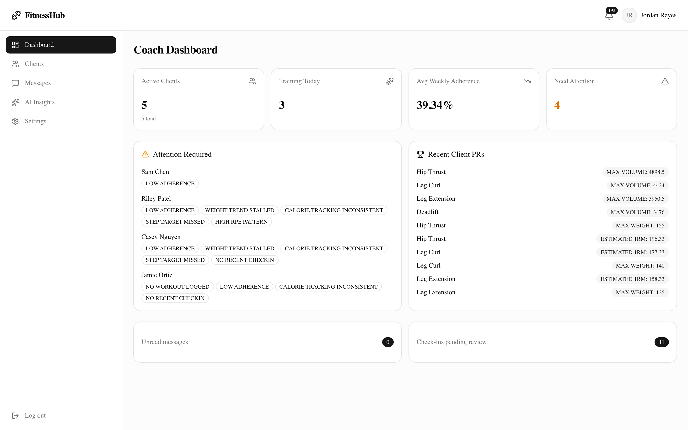
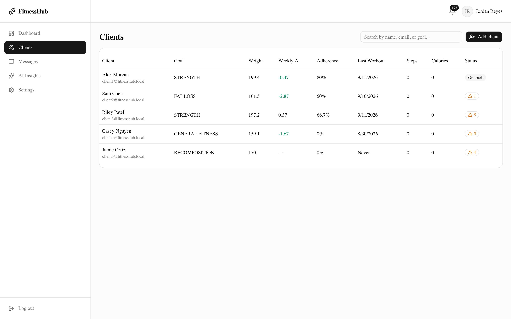
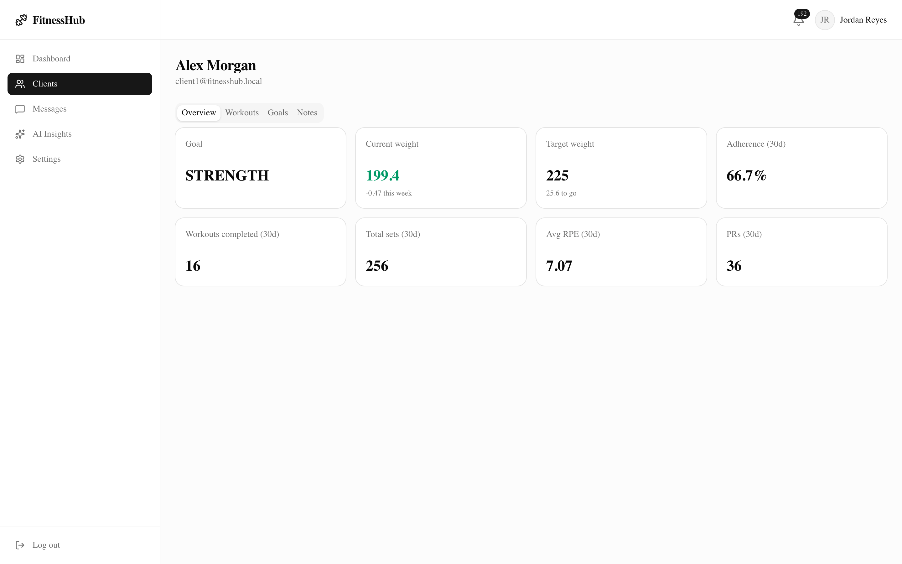
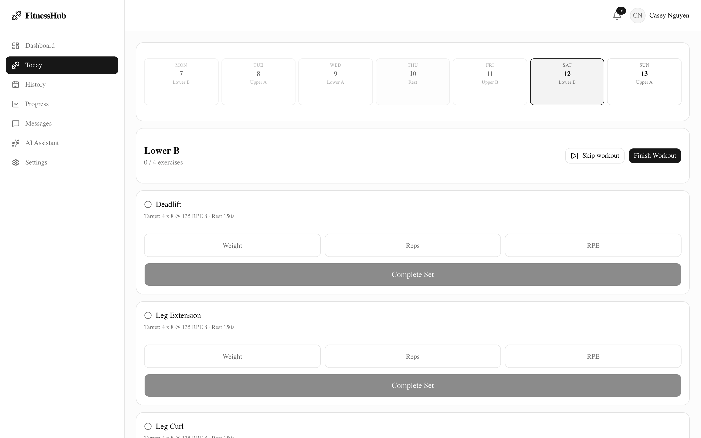
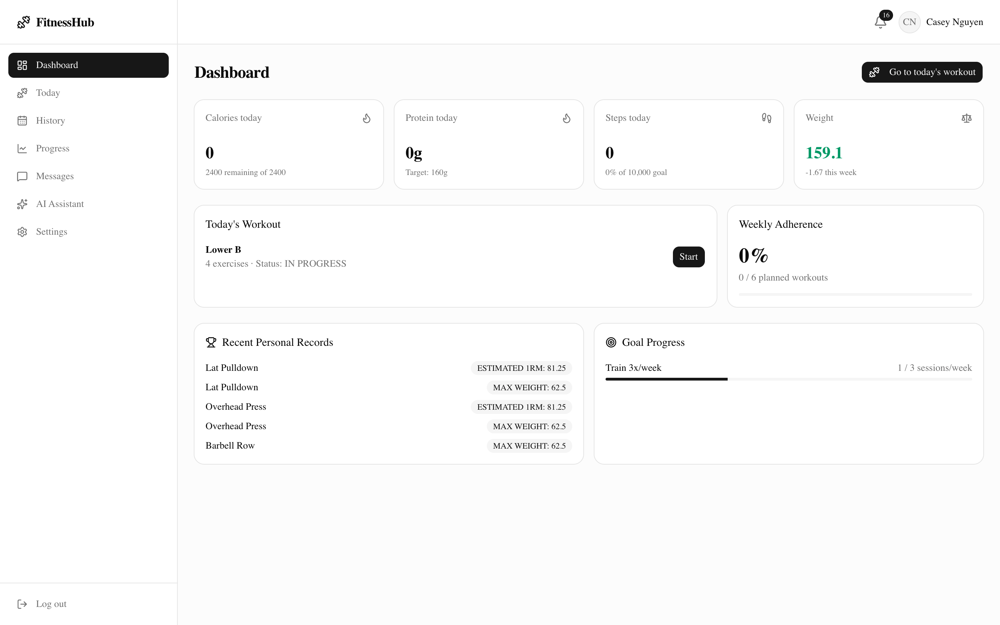
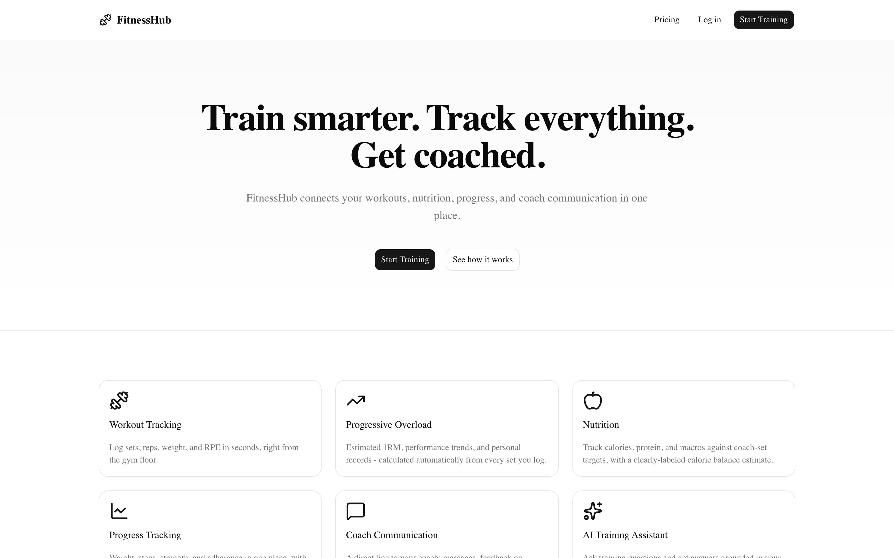

# FitnessHub

[](https://github.com/amrkasaOSU/fitnesshub/actions/workflows/ci.yml)

**Train smarter. Track everything. Get coached.**

A full-stack fitness coaching platform: workout tracking with progressive-overload
analytics, nutrition/weight/step tracking, coach-client messaging and check-ins,
a data-grounded AI training assistant, and Stripe-based subscriptions.

> **On the AI assistant and Stripe:** both sit behind provider abstractions
> that degrade gracefully. With no `OPENAI_API_KEY` set, the AI endpoints
> return a clear "not configured" message rather than erroring, and every
> other feature works untouched - so the app runs fully without any paid
> third-party account. Add a key to `.env` to switch the assistant on; any
> OpenAI-compatible endpoint works via `OPENAI_BASE_URL`. Same story for
> Stripe. See [docs/ai.md](docs/ai.md).

- **Backend:** Java 21, Spring Boot 3, Spring Security (session/cookie auth),
  Spring Data JPA, PostgreSQL, Redis, Flyway, Maven.
- **Frontend:** Next.js (App Router), TypeScript, Tailwind CSS, shadcn/ui,
  TanStack Query, React Hook Form + Zod, Recharts.
- **Architecture:** Next.js frontend → Spring Boot REST API → PostgreSQL, with
  Redis for sessions/rate limiting/caching. Modular monolith, not microservices.

## Why I built this

I train clients, and the admin side of coaching was the part that didn't scale.
Programs live in one place, logged workouts in another, and progress questions
like "is this person actually getting stronger, or just showing up?" take real
digging to answer. The tools that do exist are either priced for gyms rather
than individual coaches, or they're a workout logger with no coach side at all.

So I built the thing I wanted: a coach assigns a program once, the client logs
sets from their phone between sets at the gym, and the coach's dashboard
surfaces the parts that need attention on its own - who's fallen off, whose
numbers have stalled, who hasn't checked in. Every number a client sees is the
same number their coach sees, because both come from the same server-side
calculation.

## Screenshots

| Coach dashboard | Client roster |
|---|---|
|  |  |
| Attention flags surface which clients need a nudge, with recent PRs alongside. | Searchable roster with weight trend, adherence, and per-client flag counts. |

| Client detail | Today's workout |
|---|---|
|  |  |
| Current weight beside target, plus 30-day training summary. | Monday-Sunday week strip, per-set logging, and skip-with-reason. |

| Client dashboard | Landing page |
|---|---|
|  |  |
| Calories, protein, steps, weight, and today's session at a glance. | Public marketing page. |

All screenshots are of the running application against the seeded demo data.

## Engineering highlights

The decisions I'd want to talk through, each linked to where it lives:

- **All fitness math runs server-side.** 1RM, volume, adherence, PR detection
  and attention flags are computed in one place, so a client and their coach
  can never see different numbers for the same metric. Every formula and the
  assumptions behind it are written down in
  [docs/fitness-calculations.md](docs/fitness-calculations.md).
- **One place decides who can see what.** `CurrentUser` is the only source of
  caller identity and `AuthorizationService` the only place ownership is
  checked, so no endpoint can accidentally trust a client-supplied ID. Role
  rules in `SecurityConfig` are a coarse first filter, not the real check -
  [docs/security.md](docs/security.md).
- **The weekly schedule is derived, not stored.** When a client skips a
  session, the rest of the week shifts down. Rather than persist an offset that
  could drift, the schedule is computed as
  `(daysSinceStart - skipsThisWeek) % cycleLength` from the skip records
  themselves, so it self-corrects every Monday with no background job.
- **Third-party outages are non-events.** OpenAI and Stripe sit behind
  interfaces that return typed "not configured" results instead of throwing.
  The app runs completely without either - [docs/ai.md](docs/ai.md).
- **Verified against real infrastructure, not mocks.** Standing the stack up on
  real PostgreSQL and Redis caught two bugs unit tests could not: Hibernate
  reordering inserts so child rows were written before their parents, and a
  missing `spring-boot-starter-actuator` dependency that only failed at
  runtime. Write-up in
  [docs/development.md](docs/development.md#verifying-without-docker).

## Quick start (Docker)

```bash
cp .env.example .env
docker compose up --build
```

- Frontend: http://localhost:3000
- Backend API: http://localhost:8080
- API docs (Swagger UI): http://localhost:8080/swagger-ui.html

The backend seeds realistic demo data on first boot against an empty database
(see **Demo accounts** below) - no manual setup needed.

## Demo accounts

All demo accounts use the password `FitnessHub!2024`.

| Role   | Email                        | Story |
|--------|-------------------------------|-------|
| Coach  | coach@fitnesshub.local        | Manages all 5 clients below |
| Client | client1@fitnesshub.local      | Strength goal, bench press progressing well, high adherence, several PRs |
| Client | client2@fitnesshub.local      | Fat loss goal, weight trending down, steps improving |
| Client | client3@fitnesshub.local      | Strength plateau, high RPE, inconsistent nutrition logging - trips several attention flags |
| Client | client4@fitnesshub.local      | Inconsistent workout logging, low adherence |
| Client | client5@fitnesshub.local      | Brand-new client, almost no history |

Client 1's bench press history is deliberately built so that "should I attempt
225 today?" has a real answer in the data: weight climbing 185 -> 200 with RPE
rising alongside it and estimated 1RM flattening out. The AI assistant reasons
from those logged sets rather than returning a canned response - see
[docs/ai.md](docs/ai.md).

## Local development (without Docker)

You need JDK 21, Maven, Node 20+, PostgreSQL 16, and Redis 7 on your machine.

```bash
# Backend
cd backend
./mvnw spring-boot:run
# reads DATABASE_URL / POSTGRES_USER / POSTGRES_PASSWORD / REDIS_URL from the
# environment (see .env.example), defaulting to localhost.

# Frontend (separate terminal)
cd frontend
npm install
npm run dev
```

See [docs/development.md](docs/development.md) for the full local setup,
including how this was verified without Docker during initial development.

## Documentation

- [docs/architecture.md](docs/architecture.md) - system architecture, module layout
- [docs/database.md](docs/database.md) - schema, entity relationships, key design decisions
- [docs/api.md](docs/api.md) - REST API conventions and endpoint index
- [docs/security.md](docs/security.md) - auth, authorization, session/CSRF model
- [docs/ai.md](docs/ai.md) - AI assistant pipeline, provider abstraction, safety
- [docs/fitness-calculations.md](docs/fitness-calculations.md) - every formula (1RM, volume, adherence, calorie estimates, attention flags) and what it assumes
- [docs/development.md](docs/development.md) - local dev, testing, seed data

## Testing

```bash
cd backend
./mvnw test          # unit tests (pure logic - no DB required)
# Integration tests using Testcontainers require Docker; see docs/development.md.
```

```bash
cd frontend
npm run typecheck
npm run lint
npm run build
```

## Known limitations

Stated plainly rather than buried:

- **No integration or E2E test suite yet.** Unit tests cover the calculation
  layer (1RM, volume, adherence, PR eligibility); Testcontainers and Playwright
  suites are the next thing I'd add. The stack *has* been verified end to end
  against real PostgreSQL and Redis - see
  [docs/development.md](docs/development.md#verifying-without-docker) - but
  that verification isn't automated.
- **The AI assistant needs an `OPENAI_API_KEY`** (or any OpenAI-compatible
  endpoint) to give real answers. Without one it returns a clear "not
  configured" message and nothing else breaks.
- **Stripe billing needs real test-mode keys** to exercise end to end. Same
  graceful-degradation behaviour without them.
- **No email delivery.** Email verification and password reset have their
  schema fields but no sending integration.

## Disclaimer

FitnessHub is a fitness tracking and coaching tool. Information provided by
the application or AI assistant is for general informational purposes and is
not medical advice. Consult an appropriately qualified healthcare professional
for medical concerns, injuries, or health conditions.
